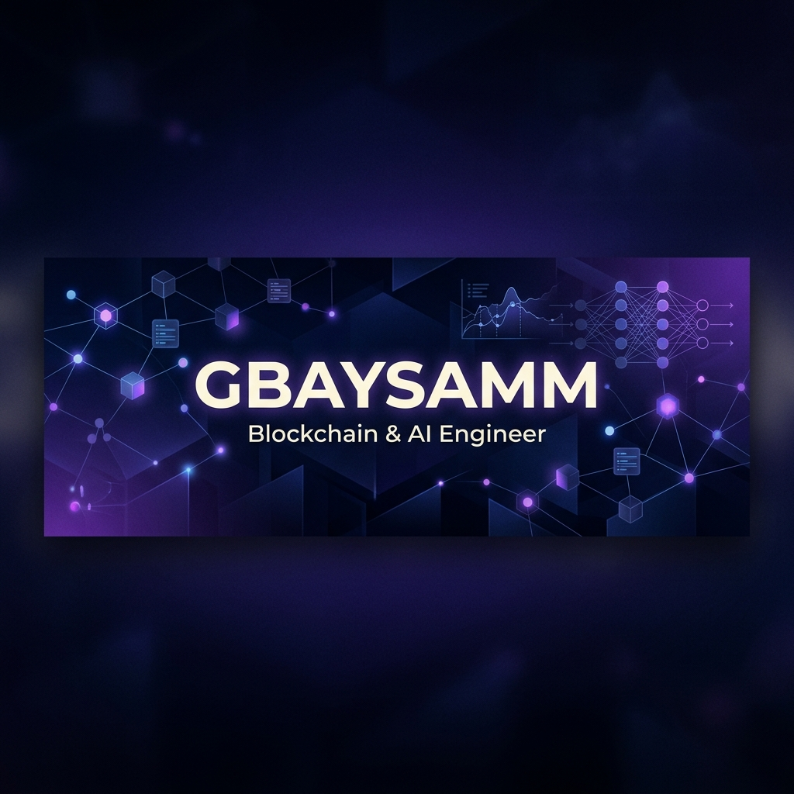

# 👋 Hi, I'm Abdulmalik (@Gbaysamm)

  

  

---

### 🚀 About Me
I'm a passionate developer focused on building scalable decentralized applications and intelligent AI solutions. Currently, I'm deep-diving into the intersection of **Blockchain** and **AI** to create next-generation platforms.

- 🔭 **Currently working on:** [Smart Scholars AI](https://github.com/Gbaysamm/smart-scholarsai)
- ⚡ **Specializing in:** Smart Contracts, Decentralized Finance (DeFi), and Full-Stack Web Apps.
- 🎓 **Learning:** Advanced Zero-Knowledge Proofs and AI-Agent Orchestration.
- 💬 **Ask me about:** JavaScript, Solidity, React, and why Blockchain is the future.

---

### 🛠️ Tech Stack

  
  
  
  
  
  
  
  
  

---

### 📊 GitHub Stats

  
  

  

---

### 📫 Connect with me

  
  

 
  

